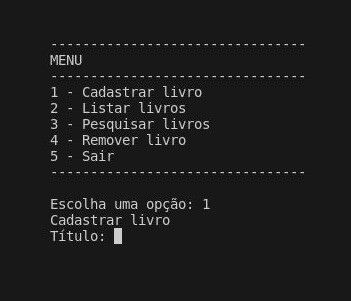

# Book Register

> Book Register is a C++ project that simulates a book registry system. It allows users to manage and store information about books, including their titles, authors, publishers, and editions. With this program, you can easily add, list, search, and remove books from the registry. It's a handy tool for organizing your book collection!

## Features

- Add a book to the registry
- List all books in the registry
- Search for a book by its title
- Remove a book from the registry

## How to Use

1. Compile the `library.cpp` file using your C++ compiler.
2. Run the compiled executable.
3. Choose from the menu options to manage your book registry.

## Contributing

If you'd like to contribute to the project, please fork the repository and create a feature branch. Pull requests are warmly welcome.

## Links

- Project homepage: https://github.com/phcrepaldi/book-register
- Issue tracker: Please submit any issues or feature requests via the GitHub issue tracker.

## Licensing

This project is licensed under the MIT License.

---

**C++ code of the project:**

```cpp
// Your C++ code for the book_register project goes here.
// ...
